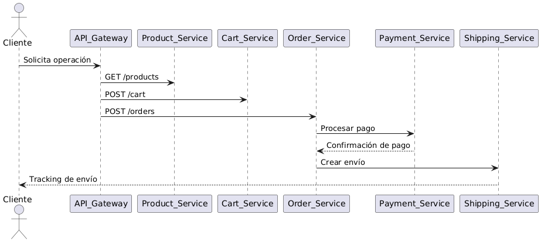
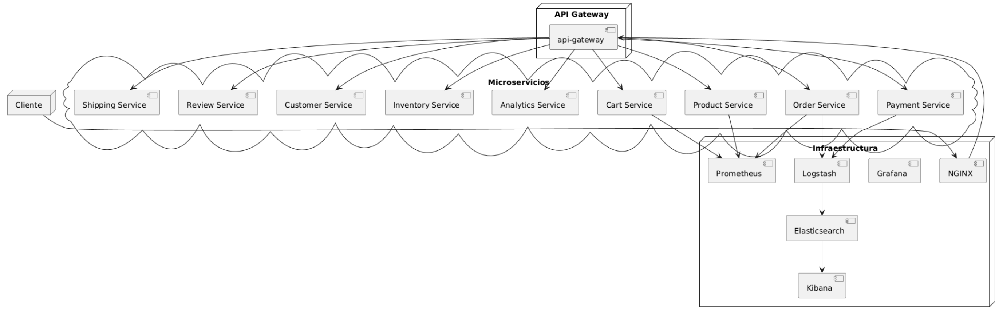
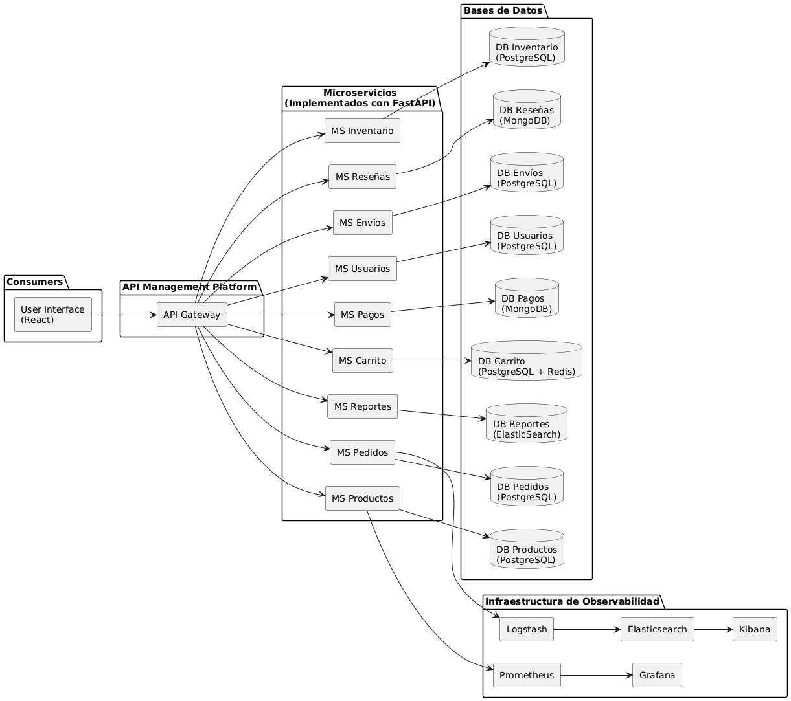

**Universidad de San Carlos de Guatemala**  
**Ingeniería en Ciencias y Sistemas**  
**Curso: Software Avanzado - Sección B**

**Carnet:** 201313861  
**Nombre Completo:** Walther Andree Corado Paiz 

# Online Shopping System - Microservices Architecture

## Propósito del Proyecto

Migrar el sistema monolítico de compras en línea a una arquitectura moderna basada en microservicios. Esto permite mayor escalabilidad, mantenibilidad, despliegue independiente y desacoplamiento de responsabilidades.

---

## Requerimientos Funcionales

| ID   | Descripción                                                                 |
|------|------------------------------------------------------------------------------|
| RF1  | Los clientes deben poder explorar productos disponibles en el sistema.      |
| RF2  | Los clientes deben poder agregar productos al carrito de compras.           |
| RF3  | Los clientes deben poder realizar el proceso de checkout y realizar pagos.  |
| RF4  | El sistema debe permitir realizar un seguimiento del estado de los pedidos. |
| RF5  | Los clientes deben poder devolver productos o solicitar cambios.            |
| RF6  | Los clientes deben poder escribir reseñas de productos adquiridos.          |
| RF7  | El sistema debe ofrecer visualización de ofertas activas.                   |
| RF8  | El administrador debe poder agregar, actualizar o eliminar productos.       |
| RF9  | El administrador debe gestionar los pedidos realizados.                     |
| RF10 | El administrador debe atender las consultas de clientes.                    |
| RF11 | El administrador debe gestionar devoluciones y reembolsos.                  |
| RF12 | El administrador debe gestionar las ofertas y promociones.                  |
| RF13 | El sistema debe permitir la visualización de reportes de ventas.            |
| RF14 | El proveedor debe poder actualizar los niveles de inventario.               |
| RF15 | El proveedor debe poder consultar pronósticos de ventas.                    |
| RF16 | El sistema debe integrarse con pasarelas de pago externas.                  |
| RF17 | El sistema debe permitir el registro, autenticación y gestión de clientes.  |
| RF18 | El sistema debe integrarse con un servicio de envíos.                       |


## Requerimientos No Funcionales

| ID    | Requerimiento                                                                 |
|-------|--------------------------------------------------------------------------------|
| RNF1  | El sistema debe escalar horizontalmente por microservicio.                    |
| RNF2  | Cada microservicio debe ser replicable para alta disponibilidad.              |
| RNF3  | Despliegue independiente para cada microservicio mediante contenedores.       |
| RNF4  | Persistencia aislada por servicio (una base de datos por microservicio).      |
| RNF5  | Seguridad mediante autenticación basada en JWT y control de acceso.           |
| RNF6  | Registro de logs y trazabilidad por microservicio.                            |
| RNF7  | Soporte de monitoreo activo de los servicios desplegados.                     |
| RNF8  | Documentación estandarizada para cada API.                                     |
| RNF9  | Comunicación RESTful y asincrónica con mensajería para eventos críticos.      |
| RNF10 | El sistema debe ejecutarse completamente usando Docker y Docker Compose.      |


## Microservicios Propuestos

### 1. Product Service

**Responsabilidad:** gestionar productos, categorías, y ofertas. **DB sugerida:** PostgreSQL **Entidades:**

- Product (id, name, description, price, stock, category\_id)
- Category (id, name)

### 2. Cart Service

**Responsabilidad:** gestión de carritos y checkout **DB sugerida:** Redis (cache) + PostgreSQL **Entidades:**

- Cart (id, customer\_id)
- CartItem (product\_id, quantity)

### 3. Payment Service

**Responsabilidad:** realizar pagos y emitir reembolsos **DB sugerida:** MongoDB (event sourcing opcional) **Entidades:**

- Payment (id, order\_id, status, amount)
- Refund (id, payment\_id, reason, status)

### 4. Order Service

**Responsabilidad:** crear y rastrear pedidos **DB sugerida:** PostgreSQL **Entidades:**

- Order (id, customer\_id, status, total\_amount)
- OrderItem (product\_id, quantity, price)

### 5. Customer Service

**Responsabilidad:** autenticación, información del cliente **DB sugerida:** PostgreSQL **Entidades:**

- Customer (id, name, email, password\_hash, phone)
- Address (customer\_id, street, city, country)

### 6. Shipping Service

**Responsabilidad:** gestión de envíos **DB sugerida:** PostgreSQL o SQLite **Entidades:**

- Shipment (order\_id, status, tracking\_number)

### 7. Review Service

**Responsabilidad:** publicar y gestionar reseñas **DB sugerida:** MongoDB **Entidades:**

- Review (id, product\_id, customer\_id, rating, comment)

### 8. Inventory Service

**Responsabilidad:** actualización de stock **DB sugerida:** PostgreSQL **Entidades:**

- InventoryLog (product\_id, delta, type, timestamp)

### 9. Analytics Service

**Responsabilidad:** emitir reportes y pronósticos **DB sugerida:** ElasticSearch + PostgreSQL para historiales **Entidades:**

- SalesReport (id, date\_range, summary)
- Forecast (product\_id, predicted\_demand)

### 10. Admin Service

**Responsabilidad:** interfaz interna para admins **DB sugerida:** comparte datos mediante API

---

## Tabla Resumen de Microservicios

| Servicio  | DB            | Expone API | Eventos clave          |
| --------- | ------------- | ---------- | ---------------------- |
| Product   | PostgreSQL    | Sí         | ProductCreated         |
| Cart      | Redis + PG    | Sí         | CartCheckedOut         |
| Payment   | MongoDB       | Sí         | PaymentSuccess, Refund |
| Order     | PostgreSQL    | Sí         | OrderCreated, Shipped  |
| Customer  | PostgreSQL    | Sí         | CustomerRegistered     |
| Shipping  | PostgreSQL    | Sí         | ShipmentSent           |
| Review    | MongoDB       | Sí         | ReviewSubmitted        |
| Inventory | PostgreSQL    | Sí         | StockUpdated           |
| Analytics | ElasticSearch | Sí         | ReportGenerated        |
| Admin     | -             | Sí         | -                      |

---

## Comunicación entre Servicios

### Patrón principal: API REST

- Todos los servicios exponen endpoints REST.
- Algunos servicios publican eventos a RabbitMQ:
  - OrderService publica `OrderPlaced`
  - PaymentService escucha `OrderPlaced`, responde con `PaymentSuccess`
  - InventoryService escucha `OrderPlaced` y actualiza stock

### API Gateway

- Acceso centralizado con Express.js o Kong
- Ruteo de endpoints externos:
  - `/api/products/*` → Product Service
  - `/api/orders/*` → Order Service
  - `/api/payments/*` → Payment Service
- Middleware:
  - Autenticación JWT
  - Límites de peticiones (rate limiting)
  - Registro de actividad

---

## Implementación con Docker

### Docker Compose inicial:

```yaml
version: '3.8'
services:

  api-gateway:
    build: ./gateway
    ports:
      - "8080:8080"
    depends_on:
      - product-service
      - cart-service
      - payment-service
      - order-service
      - customer-service
      - shipping-service
      - review-service
      - inventory-service
      - analytics-service

  nginx:
    image: nginx:alpine
    volumes:
      - ./nginx.conf:/etc/nginx/nginx.conf
    ports:
      - "80:80"
    depends_on:
      - api-gateway

  prometheus:
    image: prom/prometheus
    volumes:
      - ./prometheus.yml:/etc/prometheus/prometheus.yml
    ports:
      - "9090:9090"

  grafana:
    image: grafana/grafana
    ports:
      - "3000:3000"
    depends_on:
      - prometheus

  elasticsearch:
    image: docker.elastic.co/elasticsearch/elasticsearch:7.10.0
    environment:
      - discovery.type=single-node
    ports:
      - "9200:9200"

  logstash:
    image: docker.elastic.co/logstash/logstash:7.10.0
    ports:
      - "5000:5000"
    volumes:
      - ./logstash.conf:/usr/share/logstash/pipeline/logstash.conf

  kibana:
    image: docker.elastic.co/kibana/kibana:7.10.0
    ports:
      - "5601:5601"
    depends_on:
      - elasticsearch

  product-service:
    build: ./product-service
    ports:
      - "3001:3000"
    depends_on:
      - db_product

  db_product:
    image: postgres
    environment:
      POSTGRES_USER: user
      POSTGRES_PASSWORD: pass
      POSTGRES_DB: products

  cart-service:
    build: ./cart-service
    ports:
      - "3002:3000"
    depends_on:
      - db_cart

  db_cart:
    image: postgres
    environment:
      POSTGRES_USER: user
      POSTGRES_PASSWORD: pass
      POSTGRES_DB: cart

  payment-service:
    build: ./payment-service
    ports:
      - "3003:3000"
    depends_on:
      - db_payment

  db_payment:
    image: mongo

  order-service:
    build: ./order-service
    ports:
      - "3004:3000"
    depends_on:
      - db_order

  db_order:
    image: postgres
    environment:
      POSTGRES_USER: user
      POSTGRES_PASSWORD: pass
      POSTGRES_DB: orders

  customer-service:
    build: ./customer-service
    ports:
      - "3005:3000"
    depends_on:
      - db_customer

  db_customer:
    image: postgres
    environment:
      POSTGRES_USER: user
      POSTGRES_PASSWORD: pass
      POSTGRES_DB: customers

  shipping-service:
    build: ./shipping-service
    ports:
      - "3006:3000"
    depends_on:
      - db_shipping

  db_shipping:
    image: postgres
    environment:
      POSTGRES_USER: user
      POSTGRES_PASSWORD: pass
      POSTGRES_DB: shipping

  review-service:
    build: ./review-service
    ports:
      - "3007:3000"
    depends_on:
      - db_review

  db_review:
    image: mongo

  inventory-service:
    build: ./inventory-service
    ports:
      - "3008:3000"
    depends_on:
      - db_inventory

  db_inventory:
    image: postgres
    environment:
      POSTGRES_USER: user
      POSTGRES_PASSWORD: pass
      POSTGRES_DB: inventory

  analytics-service:
    build: ./analytics-service
    ports:
      - "3009:3000"
    depends_on:
      - elasticsearch
```

---

## Diagramas

### 1. Diagrama de Comunicación

- Cliente → API Gateway → Servicios REST (según ruta)
- Order → [event: OrderPlaced] → Payment, Inventory
- Payment → [event: PaymentSuccess] → Order




### 2. Diagrama de Componentes



### 3. Diagrama de Arquitectura



---

## Conclusión

Este rediseño permite un sistema desacoplado, escalable y fácil de mantener. Cada microservicio tiene una responsabilidad clara y se comunica mediante APIs y eventos. El uso de un API Gateway centraliza el acceso y permite aplicar reglas de seguridad y ruteo.

---
